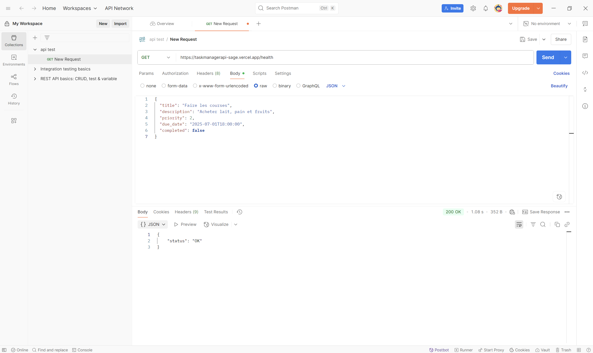
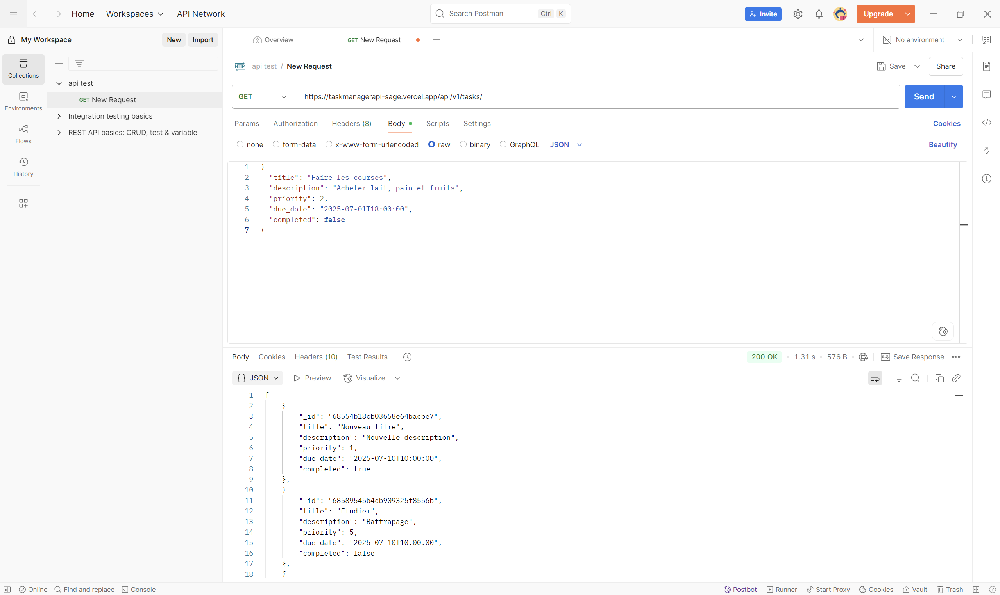
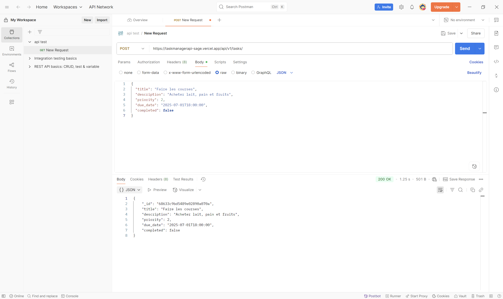
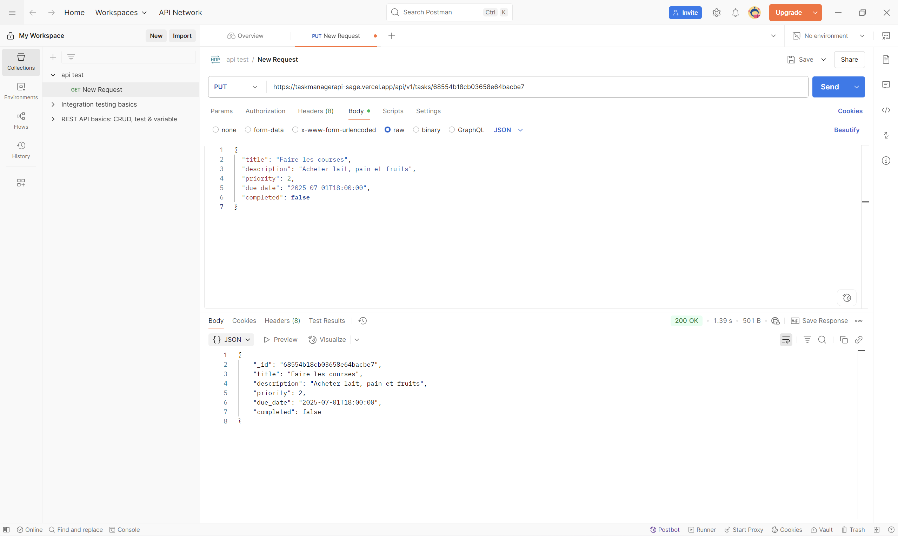
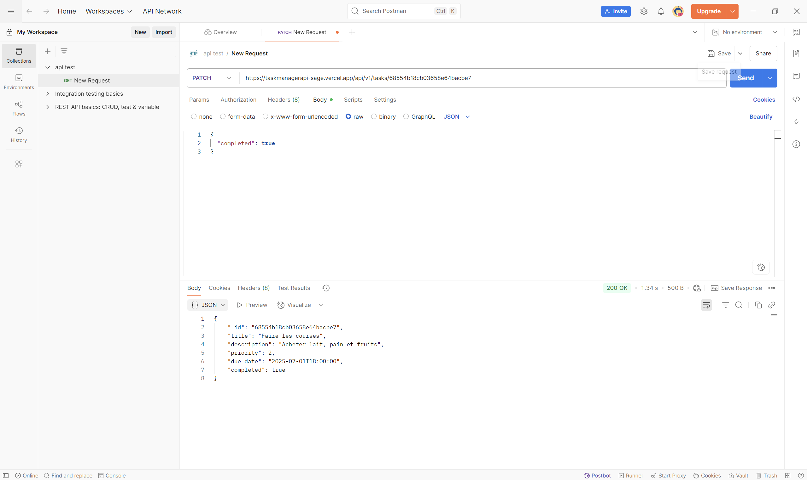
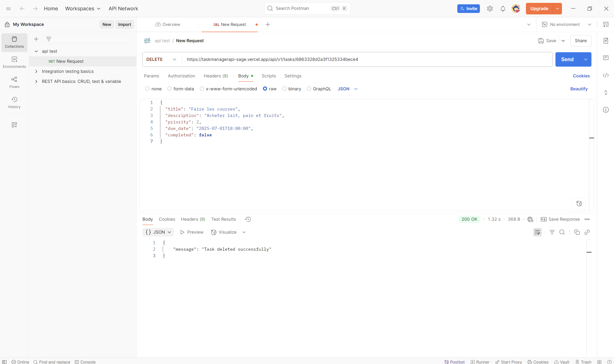

# Task Management REST API

A full-stack REST API for managing tasks, built with FastAPI, MongoDB Atlas, and deployed serverlessly on Vercel.  
Designed to demonstrate modern Python backend development, async database integration, and cloud deployment.

---

## Features

- CRUD operations for tasks (Create, Read, Update, Delete)  
- Task fields: `title`, `description`, `priority`, `due_date`, `completed` status  
- Async support with FastAPI and Beanie ODM  
- MongoDB Atlas cloud database integration (free-tier M0 cluster)  
- Serverless deployment on Vercel  
- Automatic interactive API docs with Swagger UI (`/docs`)  
- Health check endpoint (`/health`)  

---

## Getting Started

**Live API URL:** [https://taskmanagerapi-sage.vercel.app/](https://taskmanagerapi-sage.vercel.app/)

...

### Prerequisites

- Python 3.8+  
- MongoDB Atlas account with a free cluster (M0)  
- Vercel account (for deployment)  

### Local Setup

1. **Clone the repository**

   ```bash
   git clone https://github.com/yourusername/task-management-api.git
   cd task-management-api
   ```

2. **Create and activate a virtual environment**

   ```bash
   python -m venv venv
   source venv/bin/activate  # Linux/macOS
   venv\Scripts\activate     # Windows
   ```

3. **Install dependencies**

   ```bash
   pip install -r requirements.txt
   ```

4. **Set environment variable**

   Create a `.env` file or export environment variable for your MongoDB connection string:

   ```bash
   export MONGO_URI="your_mongodb_atlas_connection_string"
   ```

5. **Run the API locally**

   ```bash
   uvicorn api.main:app --reload --host 0.0.0.0 --port 8000
   ```

6. **Access API docs**

   Open your browser at [http://localhost:8000/docs](http://localhost:8000/docs) to explore the API.

---

## Deployment on Vercel

1. Push your code to a public GitHub repository.  
2. Create a new project on Vercel and link it to your GitHub repo.  
3. Set the environment variable `MONGO_URI` in Vercel dashboard (Project Settings > Environment Variables).  
4. Set the build command to:

   ```
   uvicorn api.main:app --host 0.0.0.0 --port $PORT
   ```

5. Deploy and get your live API URL from Vercel dashboard.

---

## API Endpoints

| Method | Endpoint               | Description                |
|--------|------------------------|----------------------------|
| GET    | /health                | Health check               |
| GET    | /api/v1/tasks          | List all tasks             |
| POST   | /api/v1/tasks          | Create a new task          |
| GET    | /api/v1/tasks/{id}     | Retrieve task by ID        |
| PUT    | /api/v1/tasks/{id}     | Update entire task         |
| PATCH  | /api/v1/tasks/{id}     | Partial update of task     |
| DELETE | /api/v1/tasks/{id}     | Delete a task              |

---

## Technologies Used

- **FastAPI** — modern, fast (high-performance) web framework for building APIs with Python 3.8+  
- **MongoDB Atlas** — cloud-hosted MongoDB database service  
- **Beanie** — async ODM for MongoDB, built on Motor and Pydantic  
- **Vercel** — platform for frontend and serverless backend deployment  
- **Uvicorn** — lightning-fast ASGI server for Python  

---

## Screenshots

Add screenshots of successful API calls here, corresponding to these routes:

- **GET /health** — show the health check response 
 
- **GET /api/v1/tasks** — list all tasks  
 
- **POST /api/v1/tasks** — create a new task (show request body and response) 
  
- **GET /api/v1/tasks/{id}** — get a specific task by ID  
 
- **PUT /api/v1/tasks/{id}** — update entire task (show request and updated response)
   
- **PATCH /api/v1/tasks/{id}** — partial update of task (show request with partial fields and response)
   
- **DELETE /api/v1/tasks/{id}** — delete a task (show confirmation message)
 

---
## Running the Application with Docker

To run the application inside a Docker container and access it locally, follow these steps:

1. **Build the Docker image** (if you haven't already):

```bash
docker build -t mon_app .
```

2. **Run the Docker container with port mapping:**

Before running the Docker container, you need to create a `.env` file in the project root directory containing the required environment variables.

```bash
docker run --rm -p 8000:8000 --env-file .env mon_app
```

- The `-p 8000:8000` option maps port **8000** of your local machine to port **8000** inside the container.
- You can then access the API at: [http://localhost:8000](http://localhost:8000)

3. **Stop the container**  
Press `Ctrl + C` in the terminal running the container to stop it.

---