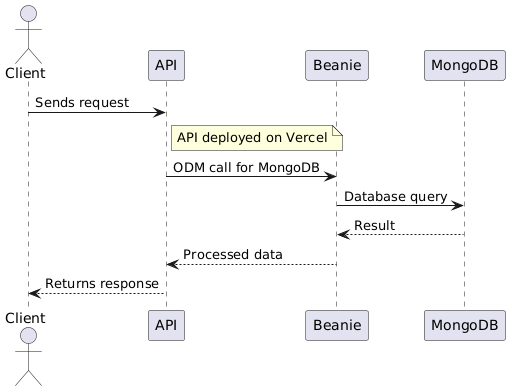

# Task Manager API

## Objectives

This project aims to create an API to manage tasks using CRUD (Create, Read, Update, Delete) operations. Each task will have a title, description, priority, due_date, and completed status. The API will automatically generate documentation. It will connect users to a NoSQL database in MongoDB and will be deployed on Vercel.

---
## Architecture Overview

The application is composed of three main components:

1. **Client**: Sends HTTP requests to the API (via tools like Postman or browser).
2. **FastAPI Backend**: Handles the requests, validates data using Pydantic, and interacts with the database.
3. **MongoDB Atlas**: Cloud NoSQL database where tasks are stored.

The backend is deployed on **Vercel** using serverless functions. All requests go through the API, which uses the **Beanie ODM** to interact asynchronously with MongoDB.

### Technologies Used

- **FastAPI** – Python web framework with async support
- **Beanie** – ODM for MongoDB based on Motor and Pydantic
- **MongoDB Atlas** – Cloud-hosted database (M0 free tier)
- **Vercel** – Serverless deployment platform
- **Pydantic** – Data validation and parsing
- **Uvicorn** – ASGI server for local development

### Sequence Diagram 

Below is the system interaction between the client, API, and MongoDB:

### Data Model: Task

The Task model includes the following fields:

- **title** (string): The name of the task.  
- **description** (string): Detailed information about the task.  
- **priority** (integer): The importance level of the task.  
- **due_date** (datetime): The deadline for the task.  
- **completed** (boolean): Status indicating if the task is done.

Data validation will be handled using Pydantic to ensure all fields have correct types and formats.

---

## API Endpoints

- **GET /health**: Checks if the API is running and healthy.  
- **GET /api/v1/tasks**: Returns all tasks stored in the database.  
- **GET /api/v1/tasks/{id}**: Retrieves the task with the specified ID.  
- **POST /api/v1/tasks**: Creates a new task with the provided data.  
- **PUT /api/v1/tasks/{id}**: Replaces the entire task identified by the given ID.  
- **PATCH /api/v1/tasks/{id}**: Updates part of the task with the specified ID.  
- **DELETE /api/v1/tasks/{id}**: Deletes the task with the given ID from the database.

---

## Security and Error Handling

- **Input validation**: All incoming data will be validated using Pydantic models to prevent invalid or malicious data.  
- **Error responses**: The API will return appropriate HTTP status codes (e.g., 400 for bad requests, 404 for not found, 500 for server errors) with clear error messages.  
- **No direct database access**: Users can only interact with data through the API, preventing unauthorized database operations.

---

## Deployment

The API will be deployed on **Vercel** using serverless functions.  
Steps include:

- Code is pushed to a public GitHub repository.  
- Vercel is connected to the GitHub repo.  
- Environment variable `MONGODB_URI` is configured in the Vercel dashboard.  
- On push, Vercel builds and deploys the FastAPI app automatically.  
- The API becomes publicly accessible through a Vercel-generated URL.

FastAPI will be adapted to run with **ASGI** and the necessary Vercel handler for serverless compatibility.

---

## Documentation

- Interactive API docs are automatically available at `/docs`.  
- ReDoc documentation is also available at `/redoc`.  
- The project includes a `README.md` file with instructions on setup, running locally, and deployment.  
- Screenshots of successful API calls (using tools like Postman) will be added as proof of functionality.
